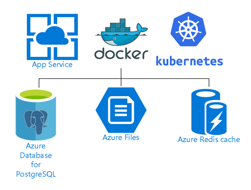

### Deploying to the cloud




[This Docker image](https://hub.docker.com/r/puckel/docker-airflow/) has been used as the base for many deployments. 


Let's try and get Airflow running on Docker:

```
docker pull puckel/docker-airflow
```

Once you have the container you can run as

```
docker run -d --rm -p 8080:8080 puckel/docker-airflow webserver
```

To load the examples you can do:
```
docker run -d -p 8080:8080 -e LOAD_EX=y puckel/docker-airflow
```

Based on this container we can deploy to [Azure](https://azure.microsoft.com/en-us/blog/deploying-apache-airflow-in-azure-to-build-and-run-data-pipelines//?wt.mc_id=PyCon-github-taallard)


[](https://portal.azure.com/#create/Microsoft.Template/uri/https%3A%2F%2Fraw.githubusercontent.com%2Fsavjani%2Fazure-quickstart-templates%2Fmaster%2F101-webapp-linux-airflow-postgresql%2Fazuredeploy.json/?wt.mc_id=PyCon-github-taallard)


Note that this is a very basic deployment on Azure.