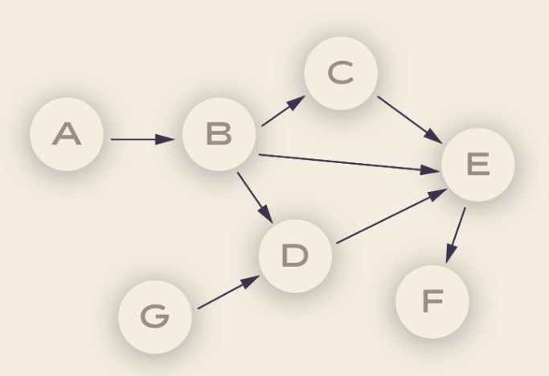

# Airflow basics

## What is Airflow?


Airflow is a Workflow engine which means:

- Manage scheduling and running jobs and data pipelines
- Ensures jobs are ordered correctly based on dependencies
- Manage the allocation of scarce resources
- Provides mechanisms for tracking the state of jobs and recovering from failure

It is highly versatile and can be used across many many domains:


## Basic Airflow concepts

- **Task**: a defined unit of work (these are called operators in Airflow)
- **Task instance**: an individual run of a single task. Task instances also have an indicative state, which could be “running”, “success”, “failed”, “skipped”, “up for retry”, etc.
- **DAG**: Directed acyclic graph,
  a set of tasks with explicit execution order, beginning, and end
- **DAG run**: individual execution/run of a DAG

**Debunking the DAG**

The vertices and edges (the arrows linking the nodes) have an order and direction associated to them



each node in a DAG corresponds to a task, which in turn represents some sort of data processing. For example:

Node A could be the code for pulling data from an API, node B could be the code for anonymizing the data. Node B could be the code for checking that there are no duplicate records, and so on.

These 'pipelines' are acyclic since they need a point of completion.

**Dependencies**

Each of the vertices has a particular direction that shows the relationship between certain nodes. For example, we can only anonymize data once this has been pulled out from the API.

## Idempotency

This is one of the most important characteristics of good ETL architectures.

When we say that something is idempotent it means it will produce the same result regardless of how many times this is run (i.e. the results are reproducible).

Reproducibility is particularly important in data-intensive environments as this ensures that the same inputs will always return the same outputs.

## Airflow components


There are 4 main components to Apache Airflow:

### Web server

The GUI. This is under the hood a Flask app where you can track the status of your jobs and read logs from a remote file store (e.g. [Azure Blobstorage](https://docs.microsoft.com/en-us/azure/storage/blobs/storage-blobs-overview/?wt.mc_id=PyCon-github-taallard)).

### Scheduler

This component is responsible for scheduling jobs. This is a multithreaded Python process that uses the DAGb object to decide what tasks need to be run, when and where.

The task state is retrieved and updated from the database accordingly. The web server then uses these saved states to display job information.

### Executor

The mechanism that gets the tasks done.

### Metadata database

- Powers how the other components interact
- Stores the Airflow states
- All processes read and write from here

## Workflow as a code
One of the main advantages of using a workflow system like Airflow is that all is code, which makes your workflows maintainable, versionable, testable, and collaborative.

Thus your workflows become more explicit and maintainable (atomic tasks).

Not only your code is dynamic but also is your infrastructure.

### Defining tasks

Tasks are defined based on the abstraction of `Operators` (see Airflow docs [here](https://airflow.apache.org/concepts.html#operators)) which represent a single **idempotent task**.

The best practice is to have atomic operators (i.e. can stand on their own and do not need to share resources among them).

You can choose among;
- `BashOperator`
- `PythonOperator`
- `EmailOperator`
- `SimpleHttpOperator`
- `MySqlOperator` (and other DB)

Examples:

```python
t1 = BashOperator(task_id='print_date',
    bash_command='date,
    dag=dag) 
```

```python
def print_context(ds, **kwargs):
    pprint(kwargs)
    print(ds)
    return 'Whatever you return gets printed in the logs'


run_this = PythonOperator(
    task_id='print_the_context',
    provide_context=True,
    python_callable=print_context,
    dag=dag,
)
```

## Comparing Luigi and Airflow

### Luigi 

- Created at Spotify (named after the plumber)
- Open sourced in late 2012
- GNU make for data

### Airflow
- Airbnb data teaam
- Open-sourced mud 2015
- Apache incubator mid 2016
- ETL pipelines

### Similarities
- Python open source projects for data pipelines
- Integrate with a number of sources (databases, filesystems)
- Tracking failure, retries, success
- Ability to identify the dependencies and execution

### Differences
- Scheduler support: Airflow has built in support using schedulers
- Scalability: Airflow has had stability issues in the past
- Web interfaces


- Tasks definitions and statuses are specified differently on both frameworks
- 