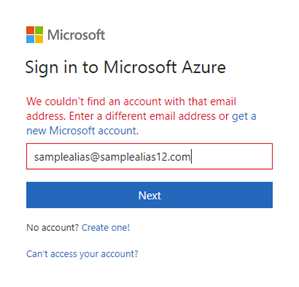
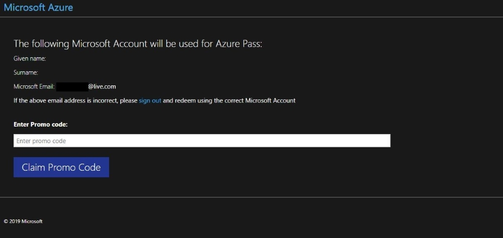
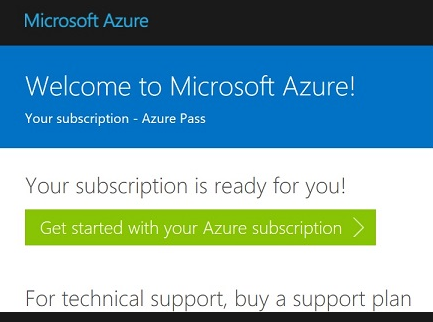

Setup
===============
This section will guide you through the pre requisites for the workshop.
Please make sure to install the libraries before the workshop as the conference WiFi 
can get quite slow when having too many people downloading and installing things at the same 
time.

Make sure to follow all the steps as detailed here especially :ref:`attendees`
as there are specific details for the PyCon setup that needs to be done in advance. 

Python 3.x
++++++++++

3.7 Preferred

We will be using `Python <https://www.python.org/>`_.
Installing all of Python's packages individually can be a bit
difficult, so we recommend using `Anaconda <https://www.anaconda.com/>`_ which
provides a variety of useful packages/tools.

To download Anaconda, follow the link https://www.anaconda.com/download/ and select
Python 3. Following the download, run the installer as per usual on your machine.

If you prefer not using Anaconda then this `tutorial <https://realpython.com/installing-python/>`_ can help you with the installation and 
setup.

If you already have Python installed but not via Anaconda do not worry.
Make sure to have either ``venv`` or ``pipenv`` installed. Then follow the instructions to set 
your virtual environment further down.

Git
+++

`Git <https://git-scm.com/>`_ is a version control software that records changes
to a file or set of files. Git is especially helpful for software developers
as it allows changes to be tracked (including who and when) when working on a
project.

To download Git, go to the following link and choose the correct version for your
operating system: https://git-scm.com/downloads.

GitHub
++++++

GitHub is a web-based service for version control using Git. You will need
to set up an account at `https://github.com <https://github.com>`_. Basic GitHub accounts are
free and you can now also have private repositories.

Text Editors/IDEs
++++++++++++

Text editors are tools with powerful features designed to optimize writing code.
There are several text editors that you can choose from.
Here are some we recommend:

- `VS code <https://code.visualstudio.com//?wt.mc_id=PyCon-github-taallard>`_: this is your facilitator's favourite 💜 and it is worth trying if you have not checked it yet
- `Pycharm <https://www.jetbrains.com/pycharm/download/>`_
- `Atom <https://atom.io>`_

We suggest trying several editors before settling on one.

If you decide to go for VSCode make sure to also
have the `Python extension <https://marketplace.visualstudio.com/itemdetails?itemName=ms-python.python&wt.mc_id=PyCon-github-taallard>`_
installed. This will make your life so much easier (and it comes with a lot of nifty
features 😎).

Microsoft Azure
+++++

You will need to get an Azure account as we will be using this to deploy the 
Airflow instance.

.. note:: If you are doing this tutorial live at PyCon US then your
    facilitator will provide you with specific instructions to set up your Azure subscription. If you have not received these please let your facilitator know ASAP.

Follow `this link <https://azure.microsoft.com/en-us/free//?wt.mc_id=PyCon-github-taallard>`_ 
to get an Azure free subscription. This will give you 150 dollars in credit so you
can get started getting things up and experimenting with Azure and Airflow.

MySQL
++++++
MySQL is one of the most popular databases used/
We need MySQL to follow along with the tutorial. Make sure to install it beforehand.

.. We are going to install MySQL later on             
.. `https://github.com/PyMySQL/mysqlclient-python <https://github.com/PyMySQL/mysqlclient-python>`_
.. for more details on how to get `mysql` running.

Mac users
------------------

.. warning:: 
    There are some known issues with MySQL in Mac so we recommend using this approach to install and set MySQL up: `https://gist.github.com/nrollr/3f57fc15ded7dddddcc4e82fe137b58e <https://gist.github.com/nrollr/3f57fc15ded7dddddcc4e82fe137b58e>`_.

Also, note that you will need to make sure that OpenSSL is on your path to make sure this is added accordingly:
If using ``zsh``:
::
    echo 'export PATH="/usr/local/opt/OpenSSL/bin:$PATH"' >> ~/.zshrc

If using ``bash``:
::
    echo 'export PATH="/usr/local/opt/openssl/bin:$PATH"' >> ~/.bashrc

make sure to reload using ``source ~/.bashrc`` or ``source ~/.zshrc``

Troubleshooting
~~~~~~~~~~~~~~~~~

Later on, during the setup,, you will be installing ``mysqlclient``. 
If during the process you get compilation errors
try the following:
::
    env LDFLAGS="-I/usr/local/opt/openssl/include -L/usr/local/opt/openssl/lib" pip install mysqlclient

if you want to be safe before installing the library we recommend you set the following env variables:
::
    export LDFLAGS="-L/usr/local/opt/openssl/lib"
    export CPPFLAGS="-I/usr/local/opt/openssl/include"

Windows users
---------------

Download and install MySQL from the official website `https://dev.mysql.com/downloads/installer/ <https://dev.mysql.com/downloads/installer/>`_ and execute it.
For additional configuration and pre-requisites make sure to visit the official `MySQL docs <https://dev.mysql.com/doc/refman/8.0/en/windows-installation.html>`_.

Linux users 
-----------------
You can install the Python and MySQL headers and libraries like so:

Debian/Ubuntu:
::
    sudo apt-get install python3-dev default-libmysqlclient-dev

Red Hat / Centos
::
    sudo yum install python3-devel mysql-devel

After installation you need to start the service with:
::
    systemctl start mysql 

To ensure that the database launches after a reboot:
::  
    systemctl enable mysql

You should now be able to start the mysql shell through ``/usr/bin/mysql -u root -p``
you will be asked for the password you set during installation.
    
Creating a virtual environment
+++++++++++++++++++++++++++++++

You will need to create a virtual environment to make sure that you have the right packages and setup needed to follow along the tutorial.
Follow the instructions that best suit your installation.

Anaconda
--------

If you are using Anaconda first you will need to make a directory for the tutorial, for example ``mkdir airflow-tutorial``.
Once created make sure to change into it using ``ch airflow-tutorial``.

Next, make a copy of this `environment.yaml <https://raw.githubusercontent.com/trallard/airflow-tutorial/master/environment.yaml>`_
 and install the 
dependencies via ``Conda env create -f environment.yml``.
Once all the dependencies are installed you can activate your environment through the following commands 
::
    source activate airflow-env # Mac
    activate airflow-env        # Windows and Linux
To exit the environment you can use 
::
    deactivate airflow-env    

pipenv
-------

Create a directory for the tutorial, for example:
::
    mkdir airflow-tutorial 

and change your working directory to this newly created one ``cd airflow-tutorial``.

Once then make a copy of this `Pipfile <https://raw.githubusercontent.com/trallard/airflow-tutorial/master/Pipfile>`_ 
in your new directory and install via ``pipenv install``.
This will install the dependencies you need. This might take a while so you can make yourself a brew in the meantime.

Once all the dependencies are installed you can run ``pipenv shell`` which will start a session with the correct virtual environment activated. To exit the shell session using ``exit``.

virtualenv
-----------
Create a directory for the tutorial, for example :
::
    mkdir airflow-tutorial 
and change directories into it (``cd airflow-tutorial``).
Now you  need to run venv 
::
    python3 -m venv env/airflow # Mac and Linux 
    python -m venv env/airflow  # Windows

this will create a virtual Python environment in the ``env/airflow`` folder.
Before installing the required packages you need to activate your virtual environment: 
::
    source env/bin/activate # Mac and Linux 
    .\env\Scripts\activate  # Windows 

Make a copy of `this requirements file <https://raw.githubusercontent.com/trallard/airflow-tutorial/master/requirements.txt>`_ 
in your new directory.
Now you can install the packages using via pip ``pip install -r requirements.txt``

To leave the virtual environment run ``deactivate``

Twitter and twitter developer account
++++++++++++++++++++++++++++++++++++++

This tutorial uses the Twitter API for some examples and to build some of the pipelines included.

Please make sure to follow the next steps to get you all set up.

1. Create an account at `https://twitter.com/ <https://twitter.com/>`_. 

2. Next, you will need to apply for a developer account, head to `https://developer.twitter.com/en/apply <https://developer.twitter.com/en/apply>`_.
    You will need to provide detailed information about what you want to use the API for. 
    Make sure to complete all the steps and confirm your email address so that you can be notified about the status of your application. 
    
    .. warning:: Before completing the application read the PyCon attendees section below ⬇️ :ref:`PyCon-tut` 

3. Once your application has been approved you will need to go to `https://developer.twitter.com/en/apps <https://developer.twitter.com/en/apps>`_ login with your details (they should be the same as your Twitter account ones).

4. On your app dashboard click on the create an app button
    .. image:: _static/twitter1.png
    Make sure to give it a descriptive name, something like ``airflow-tutorial`` or the such

5. Once you complete the details and create your new app you should be able to access it via the main app dashboard. Click on details button next to the app name and head over to permissions.
We only need read permissions for the tutorial, so these should look something like this
    .. image:: _static/twitter2.png

6. Now if you click on the Keys and tokens you will be able to see a set of an API key, an API secret, an Access token, and an Access secret
    .. image :: _static/twitter3.png
    They are only valid for the permissions you specified before. Keep a record of these in a safe place as we will need them for the Airflow pipelines.

Docker
+++++++

We are going to use Docker for some bits of the tutorial (this will make it easier to have a local Airflow instance).

Follow the instructions at `https://docs.docker.com/v17.12/install/ <https://docs.docker.com/v17.12/install/>`_ make sure to read the pre-requisites quite carefully before starting the installation.

.. _attendees:

🐍 PyCon attendees  
----------------    

.. _PyCon-tut:

Twitter developer app
~~~~~~~~~~~~~~~~~

The Twitter team will be expediting your applications to make sure you are all set up for the day 😎.

When filling in your application make sure to add the following details (as written here) to make sure this is processed.

In the what are you planning to use the developer account for:
::
    This account is to be used for the Airflow tutorial at PyCon US 2019 lead by Tania Allard.
    We will be using the Twitter API to collect tweets, setting a database and create ETL pipelines as part of the tutorial.
    This will be integrated into Airflow and no personally identifiable data will be used in the process.
    We will not be conducting text analysis, user details analysis or any sort of surveillance process as part of the tutorial.

Azure Pass account
~~~~~~~~~~~~~~~~~~~
As a PyCon attendee, you will be issued with an Azure pass worth 200 dollars with a 90 days validity.
You will not need to add credit card details to activate but you will need to follow this process to redeem your credits.

1. Send an email your facilitator at trallard@bitsandchips.me with the subject line ``Airflow PyCon- Azure Pass``, they will send you an email with a `unique` code to redeem. Please do not share with anyone, 
this is a single-use pass and once activated it will be invalid.

2. Go to `this site <https://www.microsoftazurepass.com/?wt.mc_id=PyCon-github-taallard>`_ to redeem your pass. 
We recommend doing this in a private/incognito window. You can then click start and attach your new pass to your existing account. 

If you see the following error (see image)

you can go to `this site <https://signup.live.com//?wt.mc_id=PyCon-github-taallard>`_  to register the email and proceed.

4. Confirm your email address. You will then be asked to add the promo code that you were sent by your instructor.
Do not close or refresh the window until you have received a confirmation that this has been successful. 

5. Activate your subscription: click on the activate button and fill in the personal details

Again once completed, do not refresh the window until you see this image

At this point, your subscription will be ready, click on Get started to go to your Azure portal